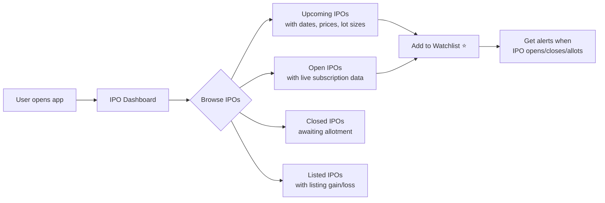
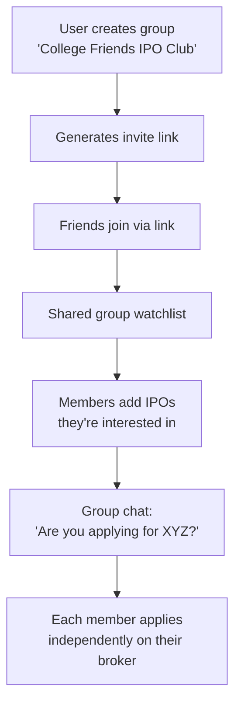
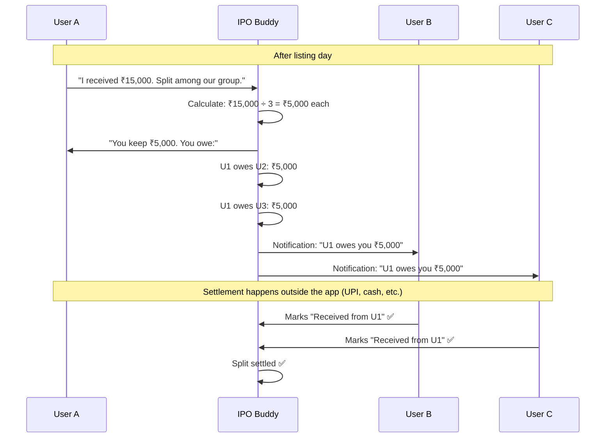
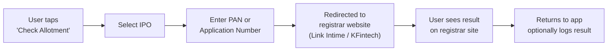
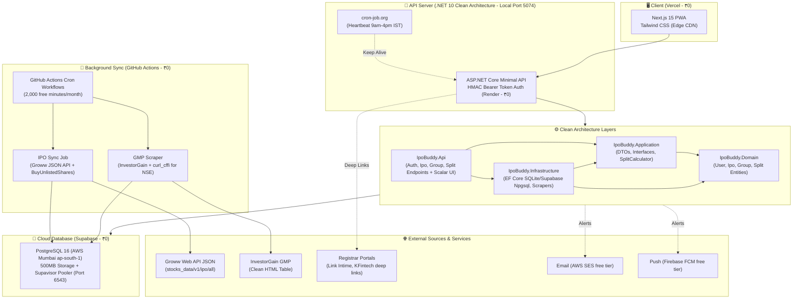
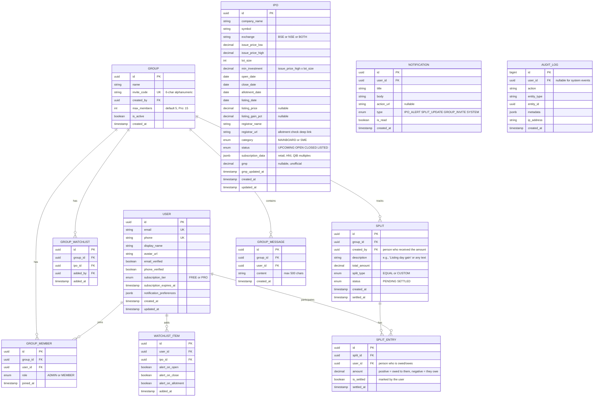

# 🚀 IPO Buddy — System Architecture Document (Revised)

> **IPO Tracking & Analytics Platform with Group Expense Splitting**
> Version 2.0 | September 2026 | De-Risked Model

---

## Table of Contents

1. [What Changed & Why](#what-changed--why)
2. [Product Definition](#product-definition)
3. [Regulatory Position](#regulatory-position)
4. [Revenue Model](#revenue-model)
5. [Core User Flows](#core-user-flows)
6. [System Architecture](#system-architecture)
7. [Tech Stack](#tech-stack)
8. [Data Models](#data-models)
9. [API Architecture](#api-architecture)
10. [Security Architecture](#security-architecture)
11. [Edge Cases](#edge-cases)
12. [Challenges & Mitigations](#challenges--mitigations)
13. [Prerequisites](#prerequisites)
14. [Infrastructure & Hosting](#infrastructure--hosting)
15. [MVP Build Timeline](#mvp-build-timeline)
16. [V2/V3 Roadmap](#v2v3-roadmap)

---

## What Changed & Why

| Original (IPO Syndicate) | Revised (IPO Buddy) | Why |
|--------------------------|---------------------|-----|
| "Centralized IPO Allotment Coordination System" | "IPO Tracking & Analytics with Group Splitting" | SEBI CIS risk eliminated |
| Platform coordinates profit-sharing syndicates | Platform is an IPO tracker; splitting is a generic calculator (like Splitwise) | No regulatory classification as investment coordinator |
| Trust scores, stranger matching, settlement tracking | Friends-only private groups, no enforcement | Zero licensing needed |
| UPI deep links for settlement | No payment integration in V1 | No RBI PA/escrow concerns |
| Requires ₹50K-1.5L for legal opinion | Launchable with ₹0 legal fees | Solo founder budget reality |
| Moderate-to-high SEBI risk | Low-to-zero SEBI risk | Platform doesn't "coordinate" anything — it's an information tool |

> [!TIP]
> **The pivot is strategic, not a retreat.** Moneycontrol, Ticker Tape, and Chittorgarh are pure info platforms worth crores. Build the audience first with zero-risk features. Add coordination features later when revenue funds legal compliance.

---

## Product Definition

### One-Liner
> **"Moneycontrol meets Splitwise — track every Indian IPO, share watchlists with friends, and split gains with a calculator."**

### What It IS
- ✅ An IPO information dashboard (upcoming, open, closed IPOs)
- ✅ Real-time subscription data, GMP tracker, allotment checker
- ✅ Private friend groups with shared IPO watchlists
- ✅ A generic group expense/income splitting calculator
- ✅ Tax calculator for listing gains
- ✅ Push/email alerts for IPO events

### What It Is NOT
- ❌ Not an investment advisor (no "apply" or "avoid" recommendations)
- ❌ Not a broker or intermediary (doesn't submit IPO applications)
- ❌ Not a payment platform (doesn't move, hold, or touch money)
- ❌ Not a profit-sharing coordinator (the calculator is generic)
- ❌ Not a fund pooling service (each user manages their own money)

### The Splitwise Analogy (Core Legal Shield)

Splitwise lets you record: *"Dinner was ₹3,000. Split among 3 people. Each owes ₹1,000."*

IPO Buddy lets you record: *"I received ₹15,000. Split among 3 people. Each person's share is ₹5,000."*

The platform doesn't know or care *why* someone received ₹15,000. It could be an IPO gain, a freelance payment, a birthday gift, or lottery winnings. The calculator is context-agnostic — just math.

---

## Regulatory Position

### Why This Model is Safe

| Regulatory Body | Concern | Our Position | Risk Level |
|----------------|---------|-------------|------------|
| **SEBI** | CIS classification | Platform is an information/analytics tool. No fund coordination, no profit-sharing agreements. | 🟢 Very Low |
| **SEBI** | Investment Advisor | No buy/sell/apply recommendations. Only factual IPO data. | 🟢 Zero |
| **RBI** | Payment Aggregator | No payment processing, no fund holding, no escrow. | 🟢 Zero |
| **DPDP Act** | Data protection | Standard SaaS compliance: consent, privacy notice, data minimization. | 🟡 Standard (same as any web app) |
| **CERT-In** | Cybersecurity | 180-day log retention, NTP sync, incident reporting. | 🟡 Standard |
| **GST/Income Tax** | Tax compliance | 18% GST on subscription fees. Standard SaaS business. | 🟢 Standard |

### Disclaimers to Display (On Every Page)

```
"IPO Buddy is an information and analytics platform. It does not provide 
investment advice, submit IPO applications, or manage funds on your behalf. 
All investment decisions are solely your responsibility. The split calculator 
is a general-purpose tool for tracking shared expenses/income among friends."
```

### What Requires Zero Licensing

| Feature | License Needed? |
|---------|----------------|
| Displaying public IPO data (dates, prices, lot sizes) | ❌ No |
| Showing subscription multiples from BSE/NSE | ❌ No |
| Displaying GMP (with "unofficial estimate" disclaimer) | ❌ No |
| Deep-linking to registrar allotment check pages | ❌ No |
| Private groups with chat | ❌ No |
| Generic split calculator | ❌ No |
| Tax calculator showing STCG rates | ❌ No |
| Charging a SaaS subscription fee | ❌ No (just GST registration) |

---

## Revenue Model

### Tier Structure

| Tier | Features | Price | Users |
|------|----------|-------|-------|
| **Free** | 5 IPO watchlist items, 1 private group (max 5 members), basic allotment checker, 3 splits/month | ₹0 | Acquisition & growth |
| **Pro** | Unlimited watchlist, 5 groups (max 15 members each), unlimited splits, GMP alerts, IPO analytics dashboard, historical data, tax calculator | ₹79/month or ₹799/year | Power users |
| **Pro+** (Future) | Everything in Pro + API access, export reports, priority notifications | ₹149/month | Serious investors |

### Why ₹79/month (Not ₹99)

₹79 crosses no psychological pricing barrier. It's cheaper than a movie ticket. Users compare it to: Netflix (₹149), Spotify (₹119), Groww Pro (₹99). At ₹79 you're the cheapest premium fintech tool.

### Unit Economics

```
Target: 5,000 users in 6 months, 10% paid conversion
  → 500 Pro subscribers × ₹799/year = ₹3,99,500/year
  → GST (18%): ₹71,910
  → Net revenue: ₹3,27,590/year (~₹27,300/month)
  → Hosting cost: ₹0/month (Serverless Free-Tier Stack)
  → Profit margin: 100% (software, zero infrastructure cash burn)
```

---

## Core User Flows

### Flow 1: IPO Discovery & Tracking



### Flow 2: Friend Groups & Watchlist Sharing



### Flow 3: Split Calculator (The Splitwise Part)



### Flow 4: Allotment Checker



---

## System Architecture

### High-Level Architecture (Zero-Cost Serverless Stack)



### Architecture Decisions

| Decision | Choice | Rationale |
|----------|--------|-----------|
| Architecture Style | **.NET 10 Clean Architecture** | Clean separation of Domain, Application, Infrastructure, and Api layers. |
| Financial Precision | **C# `decimal` (128-bit IEEE)** | Zero floating-point rounding errors across splits and tax math. |
| Hosting & DB Split | **Vercel + Render + Supabase** | 100% free forever, zero Linux administration, automated SSL, global CDN. |
| Background Scheduler | **GitHub Actions Cron (replaces Celery/Redis)** | Free PaaS hosts charge $7+/mo for background workers. GitHub Actions gives 2,000 free runner mins/mo, directly writing to Supabase. |
| DB Connection Pooler | **Supavisor (Port 6543)** | Built into Supabase; prevents serverless/Gunicorn worker spikes from exhausting Postgres connections. |
| IPO Data Pipeline | **Hybrid Public Scraping** | Uses Groww public web JSON + InvestorGain GMP + `curl_cffi` (bypasses Akamai/Cloudflare TLS fingerprinting on NSE/BSE). ₹0 API costs. |
| Real-time | **Polling (V1)** → WebSocket (V2) | Polling every 60s for notifications is fine for MVP. Django Channels for WebSocket later. |
| File uploads | **None in V1** | No proof screenshots needed. Calculator is self-reported. Removes S3 dependency. |

---

## Tech Stack (100% Zero-Cost Tier)

| Layer | Technology | Provider | Cost |
|-------|-----------|----------|------|
| **Frontend** | Next.js 15 / Tailwind CSS / React | **Vercel** (Hobby Tier) | **₹0.00** |
| **Backend API** | .NET 10 (C#) Clean Architecture / Minimal API | **Render** (Free Web Service / Docker) | **₹0.00** |
| **Database** | PostgreSQL 16 (Native, Supavisor pooler) | **Supabase** (AWS Mumbai `ap-south-1`) | **₹0.00** |
| **Data Sync / Cron** | Python scrapers on scheduled cron | **GitHub Actions** (2,000 min/mo) | **₹0.00** |
| **IPO Data Feeds** | Groww Web API + InvestorGain + `curl_cffi` | Public Web Endpoints | **₹0.00** |
| **Email** | AWS SES (62,000 free emails/month) | AWS India | **₹0.00** |
| **Push Notifications** | Firebase Cloud Messaging (FCM) | Google Firebase | **₹0.00** |
| **Uptime Heartbeat** | Ping `/api/health` every 10 min (trading hours) | **cron-job.org** | **₹0.00** |
| **Error Tracking** | Sentry (free tier: 5,000 events/mo) | Sentry.io | **₹0.00** |
| **DNS + CDN** | Cloudflare (Free tier) | Cloudflare | **₹0.00** |

**Total monthly cost: ₹0.00 / month forever** *(Annual savings: ~₹32,000)*

---

## Data Models

### Entity-Relationship Diagram



### Key Database Constraints

```sql
-- One user per group membership (no duplicate joins)
CREATE UNIQUE INDEX idx_group_member_unique
    ON group_members(group_id, user_id);

-- One watchlist entry per user per IPO
CREATE UNIQUE INDEX idx_watchlist_unique
    ON watchlist_items(user_id, ipo_id);

-- One group watchlist entry per group per IPO
CREATE UNIQUE INDEX idx_group_watchlist_unique
    ON group_watchlists(group_id, ipo_id);

-- Split amounts must be positive
ALTER TABLE splits
    ADD CONSTRAINT chk_positive_total CHECK (total_amount > 0);

-- Audit log is append-only
CREATE RULE audit_no_update AS ON UPDATE TO audit_log DO INSTEAD NOTHING;
CREATE RULE audit_no_delete AS ON DELETE TO audit_log DO INSTEAD NOTHING;
```

---

## API Architecture

### Endpoints

```
Authentication
  POST   /api/v1/auth/register              → Register (phone + OTP)
  POST   /api/v1/auth/login                 → Login (phone + OTP)
  POST   /api/v1/auth/verify-otp            → Verify OTP
  POST   /api/v1/auth/refresh               → Refresh JWT
  POST   /api/v1/auth/logout                → Revoke refresh token

Profile
  GET    /api/v1/profile                     → My profile
  PATCH  /api/v1/profile                     → Update name, avatar, prefs
  GET    /api/v1/profile/subscription        → Subscription status

IPOs
  GET    /api/v1/ipos                        → List IPOs (filter: status, category)
  GET    /api/v1/ipos/:id                    → IPO detail (subscription, GMP, dates)
  GET    /api/v1/ipos/trending               → Most-watched IPOs this week
  GET    /api/v1/ipos/:id/allotment-link     → Registrar deep link for allotment check

Watchlist
  GET    /api/v1/watchlist                   → My personal watchlist
  POST   /api/v1/watchlist                   → Add IPO to watchlist
  DELETE /api/v1/watchlist/:ipo_id           → Remove from watchlist
  PATCH  /api/v1/watchlist/:ipo_id           → Update alert preferences

Groups
  POST   /api/v1/groups                      → Create a group
  GET    /api/v1/groups                      → List my groups
  GET    /api/v1/groups/:id                  → Group details + members
  POST   /api/v1/groups/:id/join             → Join via invite code
  POST   /api/v1/groups/:id/leave            → Leave group
  DELETE /api/v1/groups/:id                  → Delete group (admin only)
  POST   /api/v1/groups/:id/kick/:user_id    → Remove member (admin only)
  PATCH  /api/v1/groups/:id                  → Update group name

Group Watchlist
  GET    /api/v1/groups/:id/watchlist         → Group's shared watchlist
  POST   /api/v1/groups/:id/watchlist         → Add IPO to group watchlist
  DELETE /api/v1/groups/:id/watchlist/:ipo_id → Remove from group watchlist

Group Chat
  GET    /api/v1/groups/:id/messages          → Messages (paginated, latest first)
  POST   /api/v1/groups/:id/messages          → Send a message

Splits
  POST   /api/v1/groups/:id/splits            → Create a new split
  GET    /api/v1/groups/:id/splits             → List splits in group
  GET    /api/v1/splits/:id                    → Split detail + entries
  POST   /api/v1/splits/:id/settle/:entry_id   → Mark entry as settled
  GET    /api/v1/splits/balances               → Net balances across all groups
  DELETE /api/v1/splits/:id                     → Delete split (creator only, if unsettled)

Notifications
  GET    /api/v1/notifications                 → My notifications (paginated)
  POST   /api/v1/notifications/read-all        → Mark all as read

Tax Calculator (Stateless)
  POST   /api/v1/tools/tax-calculator          → Input: listing gain amount
                                                  Output: STCG breakdown, net gain

Subscription (Payment)
  POST   /api/v1/subscription/checkout         → Razorpay checkout link
  POST   /api/v1/subscription/webhook          → Razorpay payment webhook
```

### Pagination & Filtering

All list endpoints return paginated responses:

```json
{
  "data": [...],
  "pagination": {
    "page": 1,
    "per_page": 20,
    "total": 142,
    "total_pages": 8
  }
}
```

IPO list supports query params: `?status=OPEN&category=MAINBOARD&sort=gmp_desc`

---

## Security Architecture

### Layers

```
Internet → Cloudflare (DDoS + CDN)
        → Nginx (TLS 1.3 termination)
        → Rate Limiter (Redis sliding window)
        → JWT Auth (djangorestframework-simplejwt)
        → Django permission checks
        → Input validation (Pydantic via Django Ninja)
        → Django ORM (parameterized queries)
        → PostgreSQL
```

### What We Store & How

| Data | Storage Method | Display |
|------|---------------|---------|
| Phone number | Plaintext (needed for OTP) | Masked: `****1234` |
| Email | Plaintext (needed for notifications) | Full (user-facing) |
| Password | Not applicable (OTP-only auth) | — |
| Display name | Plaintext | Full |
| IPO data | Plaintext (public data) | Full |
| Split amounts | `DecimalField(max_digits=12, decimal_places=2)` | Full (to group members only) |
| Chat messages | Plaintext (encrypted at rest by DB) | Full (to group members only) |
| JWT tokens | Redis (in-memory, TTL-based) | Never exposed |

> [!NOTE]
> **No sensitive financial identifiers (PAN, Aadhaar, bank accounts, demat IDs) are collected in V1.** The split calculator doesn't need them. Allotment checking is done via deep link to the registrar — the user enters their PAN on the registrar's own website, not ours. This massively reduces our data protection burden.

### Authentication Flow

```
1. User enters phone number
2. OTP sent via SMS (MSG91 / Twilio)
3. OTP verified → JWT issued
   - Access token: 15 minutes
   - Refresh token: 30 days
4. All API requests: Authorization: Bearer <access_token>
5. Token refresh: POST /auth/refresh with refresh token
```

### Rate Limiting

| Endpoint | Limit | Window |
|----------|-------|--------|
| OTP send | 3 requests | 10 minutes |
| Auth (login/register) | 5 requests | 15 minutes |
| Split creation | 20 requests | 1 hour |
| Messages | 30 requests | 1 minute |
| IPO data (read) | 100 requests | 1 minute |
| General API | 60 requests | 1 minute |

### Audit Logging

Every mutating action is logged:

```json
{
  "timestamp": "2026-09-28T14:30:00+05:30",
  "user_id": "uuid",
  "action": "SPLIT_CREATED",
  "entity_type": "split",
  "entity_id": "uuid",
  "metadata": {"group_id": "uuid", "amount": "15000.00", "members": 3},
  "ip_address": "203.0.113.42"
}
```

**Retention:** 180 days (CERT-In requirement).

---

## Edge Cases

### IPO Data Edge Cases

| Edge Case | Handling |
|-----------|---------|
| IPO date changes (postponed) | Background sync job detects date change → pushes "IPO XYZ postponed" notification to all watchers |
| IPO cancelled after users added it to watchlist | Mark IPO status `CANCELLED`, notify watchers |
| GMP data conflicting across sources | Display range (e.g., "GMP: ₹50-80") with "estimates vary" disclaimer |
| IPO data API goes down | Serve from PostgreSQL cache (last known good data). Show "last updated: X ago" timestamp |
| SME IPO vs Mainboard IPO (different allotment rules) | Tag each IPO with category. Display category-specific allotment info |

### Group Edge Cases

| Edge Case | Handling |
|-----------|---------|
| Group admin leaves | Ownership transfers to the oldest member. If only 1 member left, they become admin. |
| All members leave | Group auto-archived (soft delete). Data retained for 90 days then purged. |
| User joins with same phone on new device | OTP re-verification. Same account, new session. Old sessions invalidated. |
| Invite link shared publicly (unwanted strangers join) | Group admin can kick members + regenerate invite code. Groups have max member limits (5 free, 15 Pro). |
| Free user tries to create 2nd group | API returns 402 with upgrade prompt. Clear, friendly message. |

### Split Calculator Edge Cases

| Edge Case | Handling |
|-----------|---------|
| Split with ₹0 amount | Rejected by validation (`amount > 0` constraint) |
| Split among 1 person (just themselves) | Allowed but pointless. No entries created for others. |
| User marks "settled" but other party disagrees | Both parties see independent "settled" toggles. No enforcement — it's a tracker, not a court. |
| Decimal precision (₹15,000 ÷ 3 = ₹5,000.00) | `DECIMAL(12,2)` in PostgreSQL. Show exact amounts. If remainder exists (e.g., ₹100 ÷ 3 = ₹33.33), the creator gets the extra ₹0.01. |
| Many unsettled splits accumulate | "Net balances" endpoint aggregates across all splits: "You owe Rahul ₹2,300 net across 4 splits" |
| Split deleted after partial settlement | Only creator can delete. Entries marked "settled" are preserved. Warning: "This split has settled entries — are you sure?" |

### Notification Edge Cases

| Edge Case | Handling |
|-----------|---------|
| User has notifications disabled on device | Email fallback. Show in-app notification center. |
| Notification storm during IPO allotment day | Batch notifications. Max 5 push notifications per user per hour. Rest queued to in-app. |
| User receives notification for a group they left | Filter at query time. Notifications reference group_id — if user is no longer a member, don't display. |

---

## Challenges & Mitigations

### Technical

| Challenge | Mitigation |
|-----------|-----------|
| **IPO data freshness** | Celery beat job syncs every 30 minutes during market hours. GMP every 1 hour. Manual admin override for corrections. |
| **Scraping reliability for GMP** | Multiple source fallback. If primary scraper fails, serve last known value with "stale" flag. |
| **Scaling group chat** | V1: Simple DB-backed polling (fetch new messages every 5s). V2: Django Channels WebSocket. V3: Dedicated chat service if needed. |
| **Background job failures** | Celery retry with exponential backoff (3 retries, 30s/60s/120s). Dead letter queue for permanently failed tasks. Sentry alerts. |
| **Database connection exhaustion** | PgBouncer connection pooler. Max 20 connections from app, pooled to 5 DB connections. |

### Business

| Challenge | Mitigation |
|-----------|-----------|
| **User acquisition (chicken-and-egg for groups)** | Solo value first: IPO dashboard + personal watchlist + alerts are useful ALONE. Groups are additive, not required. |
| **Competition (Moneycontrol, Groww, Chittorgarh)** | Niche focus: ONLY IPOs, not the entire stock market. Groups + splits are unique differentiators. |
| **Free riders (never upgrade to Pro)** | Free tier is genuinely useful but limited (5 watchlist items, 1 group, 3 splits/month). Pro unlock is natural when they hit limits. |
| **Revenue before 500 paid users** | Hosting is only ₹2,700/month. 35 Pro subscribers (₹79/mo) covers hosting. Breakeven is very achievable. |

### Operational

| Challenge | Mitigation |
|-----------|-----------|
| **Solo founder = single point of failure** | Automated everything: CI/CD, monitoring, alerts, backups. If server goes down at 3 AM, DigitalOcean auto-restart + Sentry alert. |
| **Customer support volume** | In-app FAQ. Tawk.to free chat widget. Most questions are "how does allotment work?" — build great help docs. |
| **Data accuracy complaints** | Timestamp every data point. "Data sourced from BSE/NSE. Last updated: 5 min ago." Disclaimer on GMP. |

---

## Prerequisites

### Before Coding (Week 0)

- [ ] Register a Private Limited company (optional — can start as sole proprietor)
- [ ] Buy a domain name (e.g., ipobuddy.in)
- [ ] Create accounts: GitHub, Vercel, Render, Supabase, Cloudflare, AWS SES, Firebase, Sentry
- [ ] Set up development environment: Python 3.12, Node.js 20, PostgreSQL (Supabase CLI or local)
- [ ] Draft Terms of Service + Privacy Policy (template-based, ₹0)
- [ ] Set up Razorpay account for subscription payments

### Before Launch (Week 5-6)

- [ ] GST registration (if expecting > ₹20L turnover, or earlier if classified as ECO)
- [ ] SSL certificate via Cloudflare / Vercel
- [ ] DPDP compliance: consent dialog, privacy notice, grievance officer email
- [ ] Deploy Frontend to Vercel & Backend to Render
- [ ] Set up GitHub Actions cron workflows for automated scrapers
- [ ] Set up cron-job.org daytime heartbeat to prevent Render spin-down
- [ ] Basic VAPT self-assessment (OWASP ZAP free scan)
- [ ] Disclaimer text on all pages

---

## Infrastructure & Hosting

### Production Setup (₹0 / Month Forever)

```
┌─ Frontend: Vercel Hobby (₹0/mo) ─────────────────────────┐
│  Next.js 15 PWA, Global Edge CDN, Free Auto SSL          │
│  Deploy: Git push to main → auto-deploy in ~60s          │
└──────────────────────────────────────────────────────────┘

┌─ Backend: Render Free Web Service / Docker (₹0/mo) ─────┐
│  .NET 10 Clean Architecture Minimal API                  │
│  Local Dev: http://localhost:5074 (Scalar: /scalar/v1)   │
│  Memory: ~60 MB RAM (well under Render 512 MB free tier) │
│  Cold start: ~200ms compiled binary                      │
│  *Heartbeat: cron-job.org pings /api/health every 10 min │
│   during trading hours (9 AM - 4 PM IST) to prevent sleep│
└──────────────────────────────────────────────────────────┘

┌─ Cloud Database: Supabase PostgreSQL 16 (₹0/mo) ────────┐
│  Region: AWS Mumbai (ap-south-1) - RBI Compliant         │
│  500 MB Persistent Storage, Automated Backups            │
│  Supavisor Transaction Connection Pooler (Port 6543)     │
│  *Only pauses after 7 consecutive days of zero queries   │
└──────────────────────────────────────────────────────────┘

┌─ Automation & Scrapers: GitHub Actions (₹0/mo) ──────────┐
│  2,000 free runner minutes / month                       │
│  .github/workflows/ipo_sync.yml (Cron: every 2 hours)   │
│  Runs Python scrapers (Groww API, InvestorGain GMP)      │
│  Directly inserts & updates Supabase DB via DATABASE_URL │
└──────────────────────────────────────────────────────────┘

Total Monthly Cost: ₹0.00 / month
```

### Deployment Pipeline

```
GitHub Push to 'main'
  ├── 1. Vercel Webhook → Auto-builds & deploys Next.js Frontend
  ├── 2. Render Webhook → Auto-builds & deploys Django Backend
  └── 3. GitHub Actions → Runs test suite (pytest) & linter
```

---

## MVP Build Timeline

### 4-6 Week Solo Dev Plan

| Week | Focus | Deliverables |
|------|-------|-------------|
| **Week 1** | Foundation | Django project setup, User model, OTP auth, JWT. Database schema. Basic API structure. |
| **Week 2** | IPO Module | IPO data model, Celery sync job (IPO Guru API), IPO list/detail endpoints, GMP scraper. |
| **Week 3** | Groups + Watchlist | Group CRUD, invite codes, group membership, personal + group watchlists, basic chat. |
| **Week 4** | Splits + Notifications | Split calculator logic, split CRUD, net balance calculation, FCM push notifications, email alerts. |
| **Week 5** | Frontend | Next.js app: landing page, IPO dashboard, group views, split calculator UI, responsive design. |
| **Week 6** | Polish + Launch | Razorpay subscription integration, disclaimers, error handling, Sentry setup, deploy to DigitalOcean, launch! |

### Build Order Priority

```
1. Auth + User (must-have: everything depends on it)
2. IPO Dashboard (must-have: core value proposition)
3. Personal Watchlist + Alerts (must-have: retention driver)
4. Groups (must-have: differentiator)
5. Split Calculator (must-have: the "Splitwise" part)
6. Group Chat (nice-to-have: can launch without it)
7. Tax Calculator (nice-to-have: adds value but not critical for launch)
8. Subscription / Payment (must-have for revenue, but free tier works for launch)
```

---

## V2/V3 Roadmap

### V2 (Month 3-6, When You Have Revenue)

| Feature | What | Prerequisite |
|---------|------|-------------|
| **Auto allotment check** | Background job checks registrar for allotment status | Registrar scraping infra |
| **WebSocket chat** | Real-time group chat via Django Channels | Django Channels setup |
| **Weighted splits** | "I put in 2x, so I get 2x share" | Split calculator update |
| **IPO analytics** | Historical allotment rates, subscription trends, GMP accuracy | Data accumulation (3+ months) |
| **Mobile app** | React Native wrapping existing API | API already mobile-ready |
| **Trust indicators** | "Member since X, Y splits completed" (soft trust, not a score) | Data accumulation |

### V3 (Month 9-12, When You Have Users + Revenue for Legal Opinion)

| Feature | What | Prerequisite |
|---------|------|-------------|
| **UPI settlement links** | Generate UPI deep links for convenience | Legal opinion (₹50K-1.5L when affordable) |
| **Settlement tracking** | Track who paid whom | Legal opinion |
| **Stranger matching** | Match users with similar IPO interests | Trust system + legal review |
| **IPO recommendations** | Apply/avoid signals | SEBI RA registration |
| **Escrow settlement** | Platform holds funds | RBI PA license (₹15Cr net worth) + legal |

---

> [!IMPORTANT]
> **The V1 MVP is a standalone, profitable product even if V2/V3 never happen.** An IPO tracking + analytics tool with friend groups is valuable on its own. The split calculator is a bonus that makes it sticky. Don't think of V1 as "incomplete" — think of it as a complete product with a growth roadmap.

---

> **Document Status:** Ready for founder review.
> **Next Step:** Approve this architecture → Start building Week 1 (Auth + User + Django setup).
